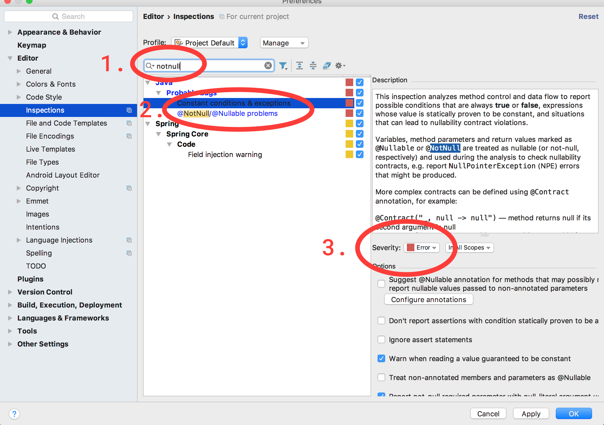
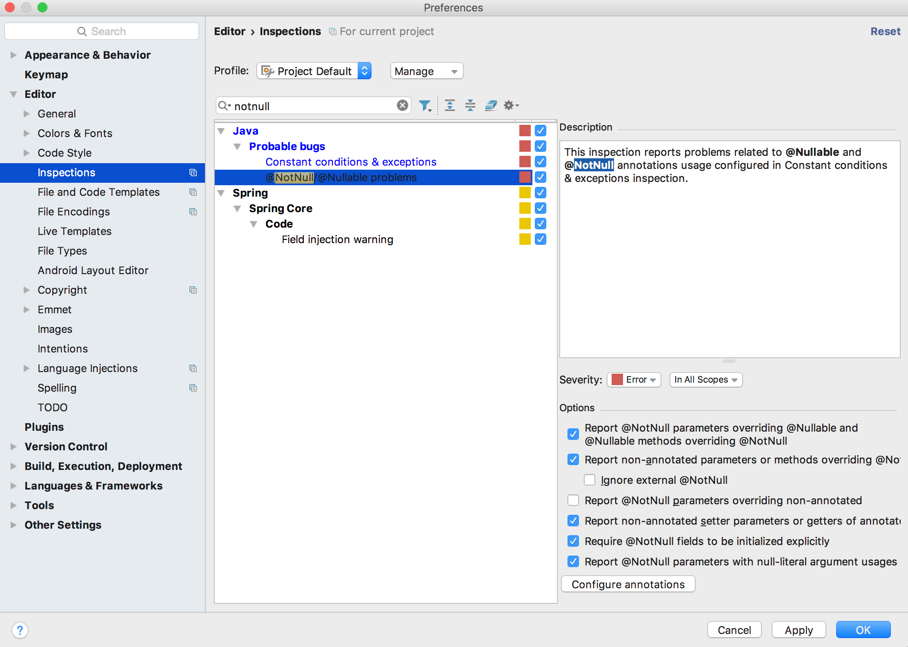

# null4j

With null4j, your code will have less NullPointerExceptions and more readable null checks.

```java

@NotNullByDefault
class Example {

	// only annotate nullable fields, everything else will be NotNull by default
	@Getter class Person  { Integer id; @Nullable Address; }
	@Getter class Address { @Nullable Street street; }
	@Getter class Street  { String streetName; }

	@Nullable Street getStreet(Person person) {
		// Use safe navigation to reach into objects without NPE
		return let(person,
			Person::getAddress,
			Address:getStreet);
	}

	// implicitely NotNull
	String getStreetName(Person person) {

		// avoid returning null by using a default value
		return orDefault(let(person,
				Person::getAddress,
				Address::getStreet,
				Street::getStreetName
		), "could not find street name");

	}
}

```

## Features

To keep it simple, null4j only contains three features:

  - @NotNullByDefault
  - orDefault
  - let

### @NotNullByDefault

This meta annotation can be applied to classes and packages. Everything will be implicitely annotated with @NotNull unless it is explicitely annotated with @Nullable.

#### Annotating classes

Using the annotation on a class works like usual:

```java
@NotNullByDefault
class SomeClass { /* ... */ }
```

#### Annotating packages

Annotating packages requires you to create a package-info.java file in the package that you want to annotate.

A package-info.java file would look like this:

```java

@NotNullByDefault
package com.example.the.package.that.contains.this.package.info.java.file;

import biz.cosee.null4j.NotNullByDefault;

```

The order is important: It won't work if you put the import before the annotation.

Note: The annotation does not work recursively yet so sub packages need their own package-info.java.

### orDefault

```java
<T> T orDefault((@Nullable T)... nullables, T defaultValue)
```

Returns the first not null parameter. The last parameter must not be null.

This is similar to SQL's coalesce or Javascript's || except that having null as the last parameter is not allowed.

#### Example

```java
// Java 7:

String s = someMap.get(key);
if(s == null) {
	s = "";
}

doSomethingWith(s);


// Java 8:

String s = someMap.getOrDefault(key, "");

doSomethingWith(s);


// null4j:

String s = orDefault(someMap.get(key), "");

doSomethingWith(s);


void example(@Nullable Thing thing) {

	Thing t = orDefault(thing, Things.STANDARD_THING);

	doSomethingWith(t);

}
```

### let 

A fluent map/flatMap for nullable types that works similar to Optional::map and Optional::flatMap.

```java
<⬤> @Nullable ⬤ let(@Nullable ⬤ value, Function<⬤, @Nullable ⬤>... functions)
```

The parameters must form a typed aligned sequence. If the last parameter is a Consumer, let returns void.

#### Example

```java

@Nullable String getName() { /* ... */ }

Map<String, String> someMap = // ...


void example() {

	// like map
	@Nullable String nullableUpperCaseName = let(getName(), String::toUpperCase);


	// map/flatMap chain that returns void and may or may not print to System.out
	let(nullableUpperCaseName,
		someMap::get,
		System.out::println
);

```

## Mockito support

It will flag errors when you try to mock something with wrong types e.g. if the original method never returns null mocking it as always returning null will be an error.

## Lombok support

Nullability annotations are copied to generated getters/setters.

```java

@Data
class Thing {
	String name;
	@Nullable String description;
}

void main() {
	Thing thing = getSomeThing();

	// fine
	thing.getName().toUpperCase();

	// Will be flagged by IntelliJ
	thing.getDescription().toUpperCase();❌

	// fine
	let(thing.getDescription(), String::toUpperCase);
}

```

## Examples

### Default Parameters

If method overloading is not an option because the method has too many parameters, orDefault can be used to declare default values for nullable parameters.

```java

void displayInfo(
	String id,
	@Nullable String name,
	@Nullable String comment,
	Address address,
	@Nullable String designation
) {
	// Set defaults for nullable parameters at the beginning of the method.
	name = orDefault(name, "no name");
	comment = orDefault(comment, "");
	designation = orDefault(designation, "no designation");


	// ...
}

```

### Safe Navigation

Suppose you have some nested types. With let, you can easily reach into them without worrying about nullpointer exceptions.

```java

@Data class Person  { int id; @Nullable Address; }
@Data class Address { @Nullable Street street; }
@Data class Street  { String name; }

@Nullable String getStreetName(Person person) {
	return let(person,
		Person::getAddress,
		Address::getStreet,
		Street::getName);
}

```

### Combining orDefault and let

```java

return orDefault(let(person,
	Person::getId,
	commentMap::get,
	String::toUpperCase
), "NO COMMENT");

```

### Nesting let to bind multiple values at once

This is similar to declaring variables, except that the null checks are included already.

```java
let(getNullableA(), a ->
let(getNullableB(), b ->
let(getNullableC(), c -> {

	System.out.println("All three are not null");

	doSomethingWithAllThree(a, b, c);

})));
```

## Refactoring existing code

### Annotate classes instead of packages

Experience shows that using @NotNullByDefault as a package annotation in legacy projects can be confusing: When you see a class that has no @NotNullByDefault annotation, is that because the package is already annotated or was it never annotated? The package annotation can also lead to problems when moving a class between annotated and non-annonated packages.

Only use the package annotation in new projects or when you annotated all of your legacy code.

### Remove null handling from functions.

Avoid code like this:

```java
// bad code

@Nullable String format(@Nullable Thing thing) {
	// this function does two things at once
	if(thing == null) {
		return null;
	} else {
		// actually relevant code
		return "It's very " + thing.getQuality();
	}
}

void example(@Nullable Thing nullableThing, Thing thing) {
	@Nullable String a = format(nullableThing);

	// this is actually never null.
	@Nullable String b = format(thing);

	// ...
}
```

Instead, simplify your functions by moving the null handling to the call site:


```java

// simple: function does only one thing
String format(Thing thing) {
	return "It's very " + thing.getQuality();
}

void example(@Nullable Thing nullableThing, Thing thing) {

	@Nullable String a = let(nullableThing, this::format);

	// no null handling needed
	String b = format(thing);

	// ...
}
```

Now the format function only does one thing instead of two and the type checker can verify that b is never null.

## Setup

Using null4j is a two step process: Add the library to your pom/gradle file, then configure IntelliJ to perform stricter tests.

### Dependency

(Available soon)

#### Maven

(XML goes here)

#### Gradle

(Groovy goes here)

### IntelliJ

You need to change two checker settings:





## Contributing

Contributions are welcome! Contact Michael Zinn on [Github](https://github.com/RedNifre) or [Twitter](https://twitter.com/RedNifre).

